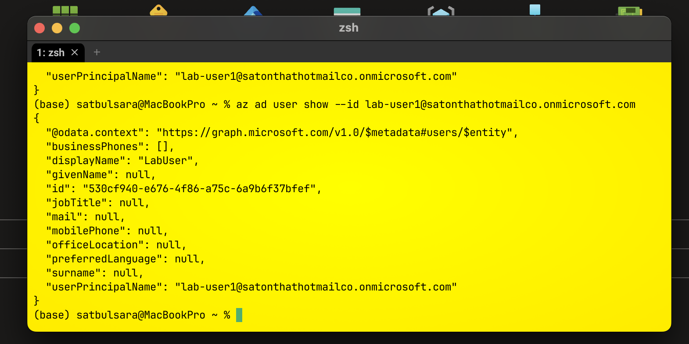
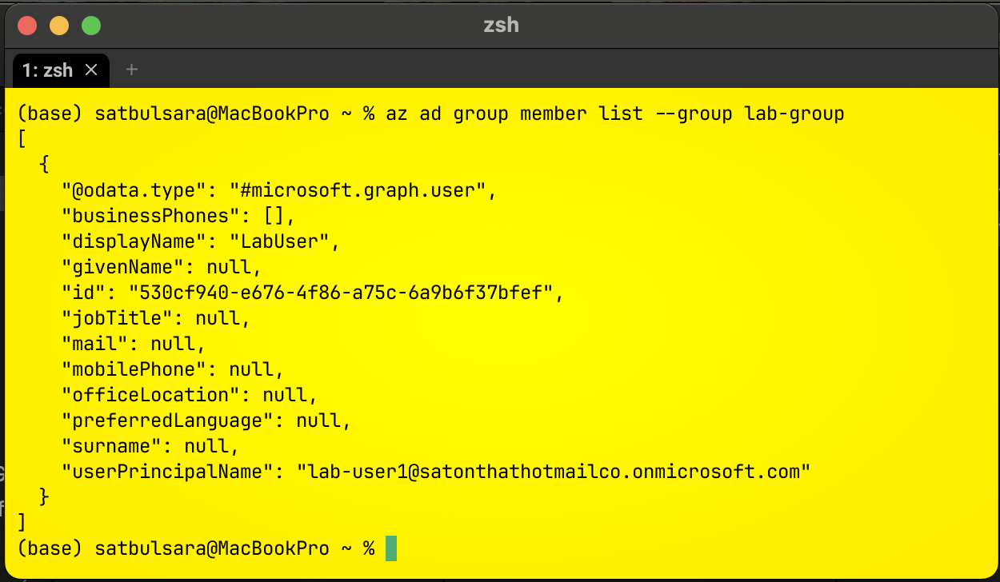

# 🔐 Azure Identity & RBAC (CLI)

---

## 🎯 Problem

In many environments, access is assigned directly to users.

This creates:
- Poor visibility
- Difficult permission management
- Over-permissioned identities

---

## 🏗️ Solution

I implemented a group-based RBAC model:

User → Group → Role → Resource

---

# 🧪 Implementation Walkthrough

---

## 👤 Step 1 — Tenant Context

```bash
az account show --query "{tenantId:tenantId, user:user.name}"
az ad signed-in-user show --query userPrincipalName
```

📸 Evidence:


---

## 👤 Step 2 — User Verification

```bash
az ad user show --id lab-user1@satonthathotmailco.onmicrosoft.com
```

📸 Evidence:



---

## 👥 Step 3 — Group Creation

```bash
az ad group show --group lab-group
```

📸 Evidence:


---

## 🔗 Step 4 — Group Membership

```bash
az ad group member list --group lab-group
```

📸 Evidence:



---

## 🏗️ Step 5 — Resource Group

```bash
az group show --name rg-lab-f1
```

📸 Evidence:


---

## 🔐 Step 6 — RBAC Assignment

```bash
az role assignment list --scope $(az group show --name rg-lab-f1 --query id -o tsv) --output table
```

📸 Evidence:


---

## 🧪 Step 7 — Break/Fix

```bash
az ad group member remove --group lab-group --member-id <user-id>
az ad group member add --group lab-group --member-id <user-id>
```

📸 Evidence:


---

## 🧠 Key Learnings

- Authentication vs Authorization
- RBAC via groups
- Inheritance model
- Immediate access removal
